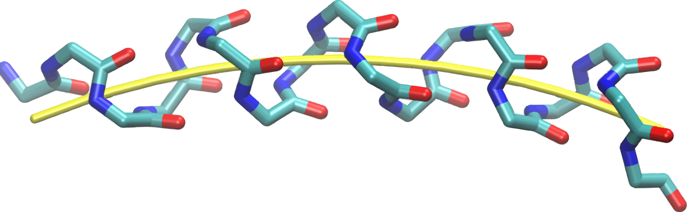

# PS
==

### PS Web Interface - A program for the analysis of Helix geometry

>The structure of helices within proteins is often distorted from the ideal linear topology. Curvature of the helix axis can be measured by determining the radius of a circle fit to the axis. Pandus Semita is a method for defining a curved path that places backbone atoms (usually Cα) equidistantly from the path. PS is a FORTRAN program that performs the Helix geometry Analysis using the curved path method.

>We implemented a web solution which basically uses current and standard web technologies facilitating the PS program execution with a friendly GUI insead of command line tools. 

### Version
1.1

### Tech

The PS web interface uses a number of open source projects to work properly:

* [HTML5] - HTML enhanced for web apps
* [PHP] - Server side code
* [JavaScript] - Client side code
* [GLmol] - 3D molecule visualization tools
* [Fortran] - PS command line based program
* [C++] - Automatic (Parallel) program for multiple HELICES analysis

### Licence

[In progress...]
